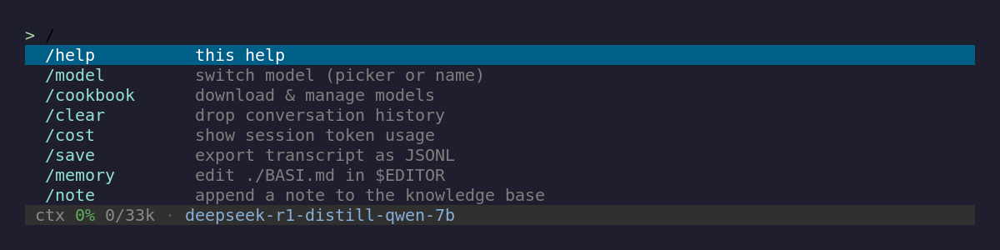
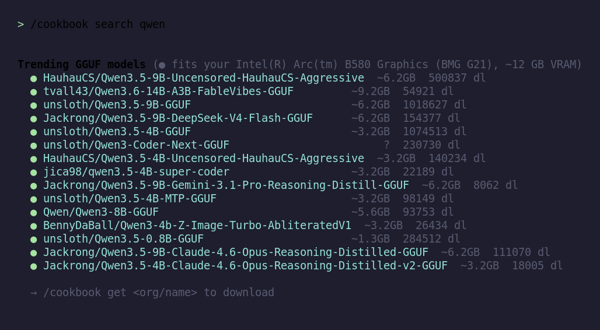

# BASI-CLI

A local-LLM **agentic CLI written in C**, built directly on [llama.cpp](https://github.com/ggml-org/llama.cpp).
BASI runs a model locally and drives it through a tool loop — read files, search and read the web,
consult a local knowledge base, query C code structure, and run multi-round **deep research** — all
from a single terminal binary.

**Design principle — *deterministic-first*:** anything that can be implemented deterministically (in
C) is; the LLM is used only for the irreducible reasoning/pattern-matching. The agent loop, tool
dispatch, ranking, guards, and parsing are plain C — the model just decides and synthesizes.

> Personal research project, Linux-only. `./install.sh` builds it from source on any distro — see [Install](#install).

Type `/` for an autocomplete dropdown of every slash command:



## Features

- **Agentic tool loop** — the model requests tools with `<tool>…</tool>`; results feed back as
  `<tool_result>` until it answers.
- **Deep research** (`--deepsearch` / `/deepsearch`) — a multi-round ReAct loop (search → read →
  synthesize) that runs in its own isolated context, distills each page to goal-relevant evidence,
  and won't answer until it has actually searched. Produces a cited answer.
- **Web** — `web_search` (thin client to a local [SearXNG](https://github.com/searxng/searxng);
  ranked, auto-fetches the top results) and `web_fetch` (curl-first, SSRF-guarded, extracts HTML via
  w3m and PDFs via pdftotext).
- **Knowledge base** — `docs_*` tools over a local `.basi/knowledge/` corpus, including semantic
  vector search backed by a GGUF embedding model.
- **Code context** — `code_context` surfaces C symbol info via a clangd LSP.
- **Editing & scaffolding** — `edit` (SEARCH/REPLACE blocks with fuzzy matching) and `scaffold`
  (templates), gated by an approval prompt.
- **Reuse & behavior guards** *(opt-in)* — deterministic, compiler-verified guardrails that stop the
  model re-implementing code the repo already has, or silently breaking an existing function while
  "refactoring". A **verified autofix** rewrites a duplicate to call the existing function *only*
  when a compiler (LLVM IR) or the language's own parser (AST) proves them equivalent; a **behavior
  guard** confirms a suspected regression against your test suite and hard-blocks a green→red change.
  Across C/C++/Python/Go/JS/TS. See [Reuse & behavior guards](#reuse--behavior-guards).
- **MCP client** — BASI is an [MCP](https://modelcontextprotocol.io) host: declare servers in
  `mcp.json` and their tools join the native set as `mcp__<server>__<tool>`, behind the same
  approval prompt as `bash`. Both transports (stdio and Streamable HTTP) and both protocol eras
  (the 2026-07-28 per-request-metadata revision *and* the legacy `initialize` handshake) are
  supported, detected per server. See [MCP servers](#mcp-servers).
- **Planning pillar** — an A3 / spike / pre-mortem plan workflow with phase-gated tools.
- **Native chat templates** — each model is driven in its *own* chat format via llama.cpp's jinja
  engine (Qwen, Gemma, DeepSeek, custom merges…), not a one-size-fits-all fallback.
- **Model cookbook** (`/cookbook`) — discover, download, and manage local GGUF models without
  leaving the REPL. Lists cached models, searches trending HuggingFace GGUF repos filtered to what
  fits your VRAM, and pulls them with `curl` straight into `~/models` (no Python / `hf` dependency);
  `/model` then switches to them.
- **Polished REPL** — a live status bar (context meter, active model, permission mode),
  live-rendered markdown, and a slash-command autocomplete dropdown (type `/`).

## Requirements

- A C/C++ toolchain (`gcc`/`g++`, C17/C++17).
- **llama.cpp built as shared libraries.** BASI links `-lllama`, `-lggml`, `-lggml-base`, and
  `-lllama-common` (the same shared common lib `llama-cli` uses). The Makefile assumes a Vulkan build
  (`build_vulkan/`, `-lvulkan`) — adjust `LLAMA_BUILD` and the backend lib for your setup.
- A model in **GGUF** format. The agentic tool loop is most reliable with a **Qwen-family instruct**
  model in the ~7–14B range — these emit BASI's native `<tool_call>` format, which BASI further pins
  with a constrained tool grammar. Very small models (≤~4B) tend to lose the thread on multi-step
  tasks, and a model whose function-calling convention BASI doesn't recognize (the grammar targets
  Qwen/Hermes-style formats — e.g. Gemma's `tool_code` blocks aren't parsed) may not drive tools at
  all. Any GGUF works for flat single-shot generation (`--no-tools`).
- Optional runtime tools: `curl` (web fetch + `/cookbook` model downloads), `w3m`, `pdftotext`
  (poppler), `unzip`, and a local **SearXNG** instance with the JSON format enabled (for
  `web_search`).

## Install

Native binaries don't move across Linux distros (glibc floors, absolute rpaths), so BASI installs by
compiling on your machine. The one-command source install clones a **pinned** upstream llama.cpp,
builds it with the **Vulkan** backend (runs on any NVIDIA/AMD/Intel GPU), compiles BASI against it,
and drops a `basi` launcher on your PATH:

```sh
./install.sh                 # add --install-deps to install build deps via your package manager
```

Already have llama.cpp built as shared libs? Reuse it and skip the clone/build:

```sh
./install.sh --llama-dir /path/to/llama.cpp --llama-build /path/to/llama.cpp/build_vulkan
```

Runtime needs a Vulkan-capable GPU driver — Mesa (`vulkan-radeon` / `vulkan-intel`) for AMD/Intel, or
the proprietary NVIDIA driver. CPU-only works but is slow.

### Manual build

```sh
make LLAMA_DIR=/path/to/llama.cpp LLAMA_BUILD=/path/to/llama.cpp/build_vulkan
```

`LLAMA_DIR` defaults to `$HOME/llama.cpp`, `LLAMA_BUILD` to `$(LLAMA_DIR)/build_vulkan`; override for
your layout. Headers come from `$(LLAMA_DIR)/include`, `$(LLAMA_DIR)/common`, and
`$(LLAMA_DIR)/vendor`; libs from `$(LLAMA_BUILD)/bin`.

## Usage

Interactive:

```sh
./basi-cli -m /path/to/model.gguf
```

Non-interactive (one-shot, prints and exits):

```sh
./basi-cli -m model.gguf -p "your prompt"                  # single agent turn (with tools)
./basi-cli -m model.gguf -p "your prompt" --no-tools       # flat completion (no tools)
./basi-cli -m model.gguf --deepsearch "your question"      # multi-round deep research
```

`--no-tools` turns `-p` into a single plain completion: no agent loop, no tool-instruction
system prompt, and **only the completion is printed to stdout** (load chatter goes to stderr) —
clean to capture in a pipe or use as a local teacher for data generation. It uses a minimal
"helpful assistant" system prompt by default; override it with `-s "<system>"`, or pass `-s ""`
for a pure completion of the prompt alone.

### Managing models

`/cookbook` downloads and manages GGUF models from inside the session — no separate tooling:

```sh
/cookbook                                # cached models + starter picks
/cookbook search qwen                    # trending GGUF that fits your VRAM
/cookbook get unsloth/Qwen3.5-9B-GGUF    # download into ~/models (resumable)
/cookbook rm qwen3.5                      # delete a cached model
```

Downloads resolve against the HuggingFace API and stream in with `curl`, so there's no Python or
`hf` dependency. After a `get`, `/model <name>` switches to the freshly pulled model.



### Hosted models (`--api`)

BASI's chat path is plain `/v1/chat/completions`, so any OpenAI-compatible provider is the same
client pointed at a different base URL — no GGUF, no VRAM fit, no spawned `llama-server`:

```sh
export FIREWORKS_API_KEY=...
./basi-cli --api fireworks --api-model accounts/fireworks/models/deepseek-v4-flash
```

Providers: `fireworks openai openrouter together groq deepseek mistral cerebras`, or pass a full
base URL. Only the **chat** model moves — embeddings (RAG, compaction) stay local.

An explicit `--api` is **remembered**, the same way the model picker remembers a GGUF, so later
launches need no flags at all:

```sh
./basi-cli api                                       # show the saved default
./basi-cli api set fireworks <model-id>              # verify key + endpoint, then save
./basi-cli api clear                                 # forget it, back to local GGUF
./basi-cli --local                                   # ignore it for one run
```

Without this, a bare `basi` always resolves the last *local* model — which silently answers "local
or hosted?" with whatever GGUF happened to be picked once. A saved backend takes precedence over
`default-model`: no GGUF is resolved and no server is spawned. The API **key is never written to
the file** — it stays in the environment.

### MCP servers

BASI connects to [Model Context Protocol](https://modelcontextprotocol.io) servers at startup and
advertises their tools to the model alongside its own. Declare them in any of these (later files
override earlier entries with the same name):

| File | Scope |
|---|---|
| `~/.config/basi-cli/mcp.json` | you, everywhere |
| `./.basi/mcp.json` | this project |
| `./.mcp.json` | this project (shared convention) |
| `--mcp-config <file>` / `BASI_MCP_CONFIG` | this run |

```json
{
  "mcpServers": {
    "filesystem": {
      "command": "npx",
      "args": ["-y", "@modelcontextprotocol/server-filesystem", "."]
    },
    "github": {
      "url": "https://api.githubcopilot.com/mcp/",
      "headers": { "Authorization": "Bearer ${GITHUB_TOKEN}" }
    },
    "staging-only": { "command": "./tools/mcp-server", "disabled": true }
  }
}
```

`${VAR}` and `${VAR:-default}` expand from the environment in every value, so a token lives in your
shell rather than in a file you might commit. An entry with `command` speaks stdio; one with `url`
speaks Streamable HTTP. Other keys: `args`, `env`, `cwd`, `disabled`, `timeoutMs`.

Tools arrive namespaced as `mcp__<server>__<tool>` — two servers can each expose a `search` without
colliding. **Every MCP call goes through the y/n/a approval prompt**, which shows the server and the
exact arguments before anything leaves the machine; `--yolo` auto-approves (required for
non-interactive `-p` runs, which otherwise auto-deny). A server's own `readOnlyHint` is shown as a
label but never skips the prompt — it is self-reported by the thing being gated.

Inspect and debug servers **without loading a model**, since connecting and calling is pure protocol:

```sh
./basi-cli mcp list                                   # connect; report era, version, tool counts
./basi-cli mcp tools [server]                         # also list every tool
./basi-cli mcp call mcp__fs__read_file '{"path":"x"}' # invoke one directly
```

In-session: `/mcp` for status, `/mcp tools [server]`, `/mcp reconnect [server]` to restart one after
editing its config. `--no-mcp` (or `BASI_MCP=0`) skips MCP entirely; a `--tools` scope that names no
`mcp__` tool skips it automatically, so hard-scoped factory phases pay nothing for it.

A server that fails to start is reported and skipped — one broken entry never stops BASI launching.
When one misbehaves, `BASI_MCP_DEBUG=1` keeps its stderr in `/tmp/basi-mcp-<name>.log`.

### Model & sampling flags

These apply to every mode (interactive, `-p`, `--no-tools`, `--deepsearch`):

| Flag | Default | Purpose |
|---|---|---|
| `-ngl`, `--ngl <n>` | `99` | Model layers to offload to GPU. **`0` = CPU only.** |
| `-c`, `--ctx <n>` | `32768` | Context size in tokens. |
| `-t`, `--temp <f>` | `0.4` | Sampling temperature (`0` = greedy). |
| `--seed <n>` | random | RNG seed. Fix it for reproducible output; vary it for diverse data-gen. |

Explicit flags win over the model picker's chosen values. Example — reproducible CPU-only
completion: `./basi-cli -m model.gguf -ngl 0 --seed 42 -p "..." --no-tools`.

Interactive slash commands: `/help`, `/model`, `/cookbook`, `/mcp`, `/deepsearch <q>`, `/plan`,
`/premortem`, `/permissions`, `/memory`, `/note`, `/edit`, `/save`, `/clear`, `/cost`. Type `/`
for an autocomplete dropdown (↑/↓ to pick, Tab to complete).

### Environment

| Variable | Default | Purpose |
|---|---|---|
| `BASI_MODEL` | — | Default model path if `-m` is omitted |
| `SEARXNG_INSTANCE` | `http://localhost:8888` | SearXNG endpoint for `web_search` |
| `SEARXNG_HOME` | `~/Documentos/searxng` | Local SearXNG to auto-launch at startup |
| `BASI_NO_SEARXNG` | — | Set to disable the SearXNG auto-launch |
| `BASI_MCP` | on | Set to `0` to disable MCP (same as `--no-mcp`) |
| `BASI_MCP_CONFIG` | — | Extra MCP config file (same as `--mcp-config`) |
| `BASI_MCP_PROBE_MS` | `5000` | Era-probe / handshake timeout per server |
| `BASI_MCP_TIMEOUT_MS` | `60000` | Per-request timeout for MCP calls |
| `BASI_MCP_DEBUG` | — | Set to `1` to keep each stdio server's stderr in `/tmp/basi-mcp-<name>.log` |
| `BASI_DEEPSEARCH_ROUNDS` | `5` | Max deep-research rounds |
| `BASI_DEEPSEARCH_CTX` | `32768` | Deep-research context size (lower for interactive `/deepsearch` on a single GPU) |
| `BASI_REUSE_GATE` / `BASI_REUSE_AUTOFIX` / `BASI_REUSE_REGRESS` | off | Enable the reuse gate / verified autofix / behavior guard — see [Reuse & behavior guards](#reuse--behavior-guards) |

## Reuse & behavior guards

Local models tend to re-implement code that already exists, or "consolidate" two similar functions
and silently change one of them — bugs that compile and pass the type-checker. BASI ships three
deterministic guardrails for this, each decided by a **compiler or a real parser, never a heuristic
or the LLM**. Because the decision is plain C, the guards behave **identically for any model** BASI's
tool loop can drive — a capable model, faced with a hard-block ("a passing test now fails"), reliably
recognises the mistake and fixes it rather than shipping it. All are opt-in (default off) and degrade
safely: when a language's verifier tool is missing, detection still works and the safety-critical
steps refuse rather than guess. **Nothing is ever fetched from the network** — verifiers use tools
already on your machine (including the project's own `typescript`).

| Guard | Enable | What it does |
|---|---|---|
| **Reuse gate** | `BASI_REUSE_GATE=1` | Before an `edit` adds a new top-level function, blind-rename token clone detection (NiCad-style trigram Jaccard) compares it against a project symbol index. A near-duplicate pauses the edit and points at the existing function. |
| **Verified autofix** | *(also)* `BASI_REUSE_AUTOFIX=1` | When the new function is a high-confidence duplicate **and a compiler certifies it equivalent**, rewrites its body to a call to the existing one. This is *output-side* — it doesn't depend on the model heeding a warning. Behavioural twins that merely *look* alike (e.g. redis's `anetSendTimeout` vs `anetRecvTimeout`, which differ by one constant) are refused. |
| **Behavior guard** | `BASI_REUSE_REGRESS=1` | After an edit, if it changed the behaviour of a function that already existed, confirm against your test suite and **hard-block + revert only when a previously-green test goes red**. Catches the "compiles, passes the type-checker, silently wrong" regressions a refactor introduces — e.g. routing an existing shape's hit-test through new geometry. |

**Language coverage.** A language is one config entry; extraction is
[Universal Ctags](https://github.com/universal-ctags/ctags), so adding one needs no parser.

| Language | Detect | Verified autofix | Behavior guard | Equivalence verifier |
|---|---|---|---|---|
| C, C++ | ✓ | ✓ | ✓ | `clang -O2 -emit-llvm` — normalized LLVM IR |
| Python, Go | ✓ | ✓ | ✓ | `python3` `ast` / `go/parser` — normalized AST |
| TypeScript | ✓ | — | ✓ | the project's own `typescript`, driven by `node` |
| JavaScript | ✓ | — | — | none (detect-only) |

The verifier a language needs must be on PATH — `clang` (C/C++), `python3`, `go`, or `node` plus the
project's `typescript` (TS). The IR/AST check is *sound, not complete*: it only substitutes or blocks
when the tool is confident, so it never makes a wrong rewrite or a false block on unverifiable code.

**Related environment variables:**

| Variable | Default | Purpose |
|---|---|---|
| `BASI_REUSE_TEST_CMD` | auto-detect | Test command the behavior guard confirms a flag against (else it tries `go test ./...` / `make test`). |
| `BASI_REUSE_TAU` | `0.50` | Clone-similarity threshold for the reuse gate. |
| `BASI_REUSE_DEBUG` | — | Trace each guard decision to stderr. |
| `BASI_REUSE_CLANG` / `BASI_REUSE_PYTHON` / `BASI_REUSE_GO` / `BASI_REUSE_NODE` / `BASI_REUSE_CTAGS` | — | Override the verifier/extractor binaries. |

## License

[MIT](LICENSE).
